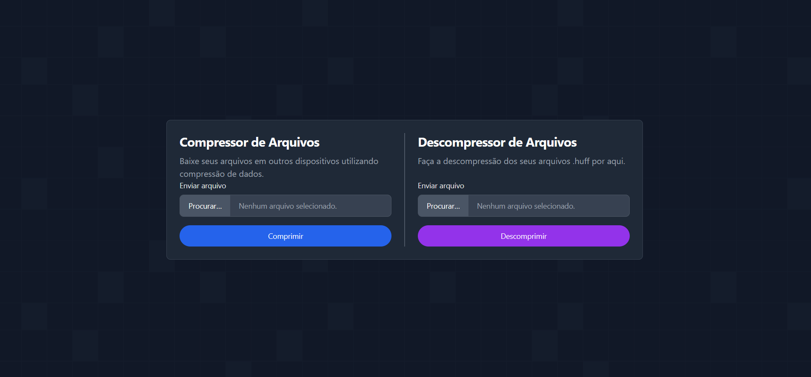

# ALGORITMOS GULOSOS — Compressor de Arquivos com Huffman

**Conteúdo da Disciplina**: Algoritmos Gulosos

## Alunos

| Matrícula | Aluno |
| -- | -- |
| 231026901 | Caio Ferreira Duarte |
| 211029601 | Victor Pontual Guedes Arruda Nobrega |

## Sobre
Este projeto é uma aplicação web para compressão e descompressão de arquivos utilizando o **algoritmo de Huffman**, um exemplo clássico de algoritmo guloso. O objetivo é demonstrar a eficácia da codificação de Huffman para a compressão de dados sem perdas.

A aplicação é desenvolvida em Python, utilizando `Flask` para o backend, e permite que o usuário faça o upload de um arquivo, o comprima para o formato `.huff` e, em seguida, faça o download do arquivo comprimido ou o descomprima de volta ao seu formato original.

## Algoritmo (visão geral)

### Codificação de Huffman — Um Algoritmo Guloso
O algoritmo de Huffman constrói uma árvore de prefixos de baixo para cima (bottom-up). Ele começa tratando cada símbolo do arquivo como um nó folha e, em cada passo, combina os dois nós de menor frequência para formar um novo nó interno. A frequência do novo nó é a soma das frequências de seus filhos. Esse processo é repetido até que reste apenas um nó, a raiz da árvore.

A abordagem é "gulosa" porque, a cada etapa, ele faz a escolha localmente ótima de mesclar os dois nós menos frequentes, o que leva a uma solução globalmente ótima, resultando em um código de prefixo de comprimento variável e ideal para a compressão.

## Screenshots
Exemplo da execução da Aplicação:
<p align="center">
  
</p>
<p align="center">
  
</p>

## Instalação
Requisitos:
- Python 3.8+

Passos:
1. Clonar o repositório.
2. (Opcional) Criar e ativar um ambiente virtual.

```powershell
python -m venv .venv
./.venv/Scripts/Activate.ps1
```
3. Instalar as dependências:
```powershell
pip install -r requirements.txt
```

## Uso

1. Abra um terminal na pasta do projeto.

2. Execute a aplicação Flask:

```powershell
python src/app.py
```

## Apresentação

Vídeo disponível em:
https://youtu.be/yelaodjaVXI